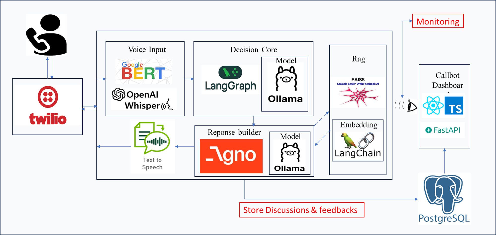

# Callbot Julie — AI-Powered Call Center Assistant

An intelligent voice assistant for CNP Assurances that handles customer inquiries via phone using Twilio, RAG-based knowledge retrieval, and AI decision making.

## Architecture



## Features

- **Voice Integration** — Twilio-powered phone calls with speech recognition
- **AI Decision Engine** — LangGraph orchestration with rules-based or LLM mode
- **RAG Knowledge Base** — FAISS vector search for insurance documentation
- **Smart Routing** — Automatic escalation to human agents when needed
- **Customer Feedback** — Post-call satisfaction collection
- **Dashboard** — React-based analytics dashboard with PostgreSQL backend

## Project Structure

```
Julie/
├── app/                      # Main Application
│   ├── twilio_server.py      # Twilio webhook server (PORT 3000)
│   ├── twilio_client.py      # Twilio API client
│   └── main.py               # CLI interface (optional)
│
├── core/                     # AI Decision Engine
│   ├── entrypoint.py         # Main entry point
│   ├── graph.py              # LangGraph orchestration
│   ├── decision_engine.py    # Rules-based decisions
│   ├── rules.py              # Intent/urgency keywords
│   └── llm_ollama.py         # Ollama LLM integration
│
├── tool_router/              # Response Generation
│   └── src/
│       ├── services/         # Orchestrator, TTS, Response Builder
│       ├── agents/           # CRM & Human Handoff agents
│       └── database/         # PostgreSQL service
│
├── RAG/                      # Knowledge Base
│   ├── rag_api.py            # FAISS vector search
│   ├── build_index.py        # Index builder
│   └── data/kb.jsonl         # Knowledge base data
│
├── Dashboard/                # Analytics Dashboard
│   ├── src/                  # React frontend (Vite + TypeScript)
│   └── backend/              # FastAPI backend (PORT 3001)
│
└── .env                      # Configuration
```

## Quick Start

### Prerequisites

- Python 3.10+
- Node.js 18+
- PostgreSQL 14+
- Twilio account
- ngrok (for development)

### 1. Clone & Setup Environment

```powershell
cd final

# Create virtual environment
python -m venv venv
.\venv\Scripts\Activate.ps1

# Install Python dependencies
pip install -r requirements.txt
```

### 2. Configure Environment

```powershell
# Copy example and edit with your values
copy .env.example .env

Edit `.env` with your credentials

### 3. Setup Database

```powershell
# Run migrations
cd Dashboard\backend\database
.\reset_db.ps1
```

### 4. Start Services

**Option A — Using Start Script (Recommended)**
```powershell
# Start all services at once
.\start.ps1 -All

# Or use batch file
.\start.bat
```

**Option B — Manual Start (4 terminals)**

**Terminal 1 — Twilio Server (Main Callbot)**
```powershell
cd final
.\venv\Scripts\Activate.ps1
python app/twilio_server.py
# Server runs on http://localhost:3000
```

**Terminal 2 — Dashboard Backend**
```powershell
cd final\Dashboard\backend
..\..\.venv\Scripts\Activate.ps1
uvicorn app.main:app --reload --port 3001
# API runs on http://localhost:3001
```

**Terminal 3 — Dashboard Frontend**
```powershell
cd final\Dashboard
npm install
npm run dev
# Frontend runs on http://localhost:5173
```

**Terminal 4 — ngrok (for Twilio webhooks)**
```powershell
ngrok http 3000
# Copy the HTTPS URL
```

### 5. Configure Twilio Webhook

In Twilio Console → Phone Numbers → Your Number:
- Voice webhook: `https://your-ngrok-url.ngrok.io/voice`
- Method: POST

## API Endpoints

### Twilio Server (Port 3000)

| Endpoint | Method | Description |
|----------|--------|-------------|
| `/` | GET | Health check |
| `/voice` | POST | Main voice webhook |
| `/feedback` | POST | Satisfaction feedback |
| `/hangup` | POST | Call termination |
| `/call_completed` | POST | Transfer completion |

### Dashboard API (Port 3001)

| Endpoint | Method | Description |
|----------|--------|-------------|
| `/api/interactions` | GET | List all interactions |
| `/api/interactions/stats` | GET | Statistics summary |
| `/api/conversations/{id}` | GET | Conversation details |

## Ollama Setup (Optional)

For LLM-enhanced responses:

```powershell
# Install Ollama from https://ollama.ai
ollama serve
ollama pull llama3.2:1b-instruct

# Enable in .env
CALLBOT_USE_LLM=true
```

## Configuration Options

| Variable | Default | Description |
|----------|---------|-------------|
| `TWILIO_ACCOUNT_SID` | - | Twilio account SID |
| `TWILIO_AUTH_TOKEN` | - | Twilio auth token |
| `DATABASE_URL` | - | PostgreSQL connection string |
| `CALLBOT_USE_LLM` | `false` | Enable Ollama LLM mode |
| `HUMAN_AGENT_NUMBER` | - | Escalation phone number |

## License

CNP Assurances / AI Dreamer
